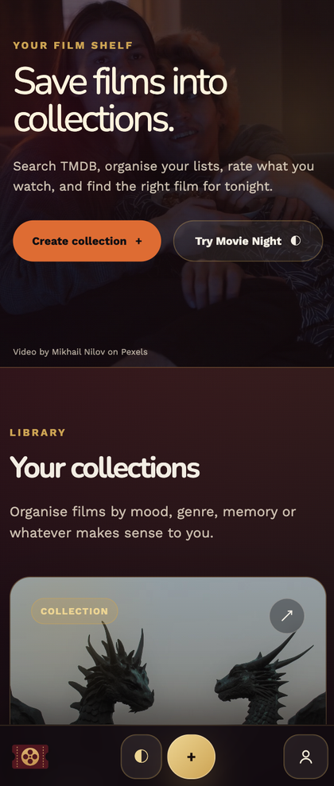
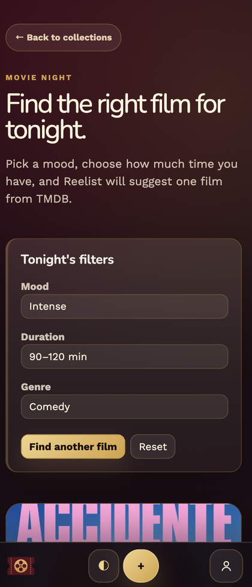
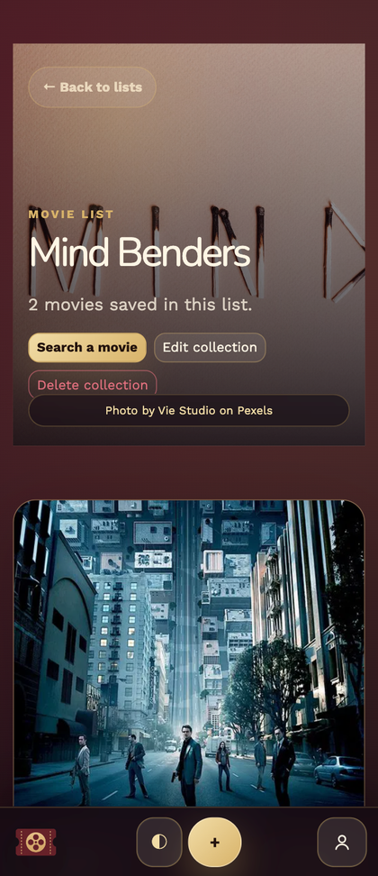
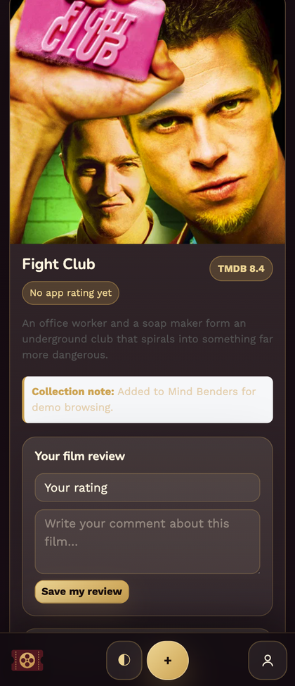
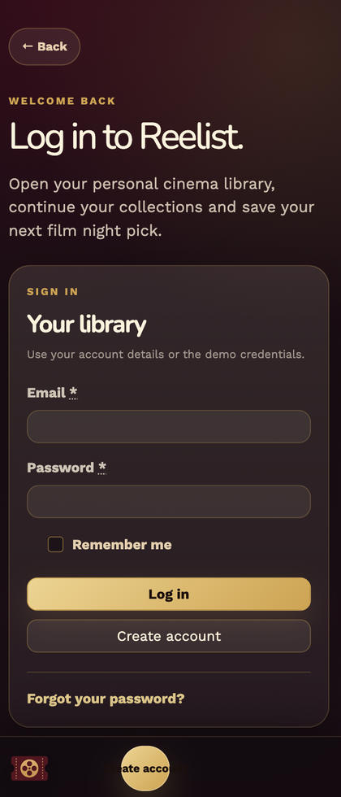

# Reelist


[](https://github.com/jcparfait/reelist/actions/workflows/ci.yml)

**Reelist** is a mobile-first Ruby on Rails app for building a personal cinema library. Users can create film collections, import real movie data from TMDB, choose cinematic cover images from Pexels, rate films, and use a **Movie Night** recommender to find a film based on mood, duration and genre.

This project started as a Rails watch-list exercise and was reworked into a more complete product-oriented portfolio app for recruiter review.

## Live demo

**Production:** [https://jcparf-reelist-14840d80eec3.herokuapp.com](https://jcparf-reelist-14840d80eec3.herokuapp.com)

Demo account:

```text
Email: demo@reelist.app
Password: password
```

## Screenshots

| Home / library | Movie Night | Collection detail |
| --- | --- | --- |
|  |  |  |

| Movie review | Authentication |
| --- | --- |
|  |  |

## What this app demonstrates

- **Rails MVC fundamentals** with scoped, user-owned resources.
- **Authentication and account management** with Devise.
- **External API integration** with TMDB and Pexels.
- **Environment-based credentials** and production error handling.
- **Data modeling** for many-to-many collections, saved movies and user-specific reviews.
- **Responsive product UI** with a cinema-inspired visual identity and mobile bottom navigation.
- **Production deployment** on Heroku with PostgreSQL, Puma and config vars.
- **Recruiter-friendly project hygiene**: README, demo seed data, CI, tests and security checks.

## Product scope

Reelist is designed around three core user flows:

1. **Build a film shelf** — create collections such as `Mind Benders`, `Science Fiction` or `Critics Night`.
2. **Import real movies** — search TMDB, save movies to a collection and keep notes.
3. **Choose tonight's film** — use Movie Night filters to get a recommendation from TMDB and save it directly.

## Key features

- User sign up, login, logout and account settings.
- User-owned collections with custom names and visual covers.
- Pexels image search for collection cover pictures.
- TMDB movie search and one-click movie import.
- Movie Night recommender using mood, duration and genre filters.
- Saved movie notes per collection.
- Film-level app ratings and user comments.
- Pexels video hero on the home page.
- Mobile-first navigation with bottom action bar.
- Custom 404 and 500 pages.
- Heroku-ready production configuration.

## Tech stack

| Layer | Tools |
| --- | --- |
| Backend | Ruby `3.3.5`, Rails `8.1.x` |
| Database | PostgreSQL |
| Auth | Devise |
| Frontend | ERB, Turbo, Stimulus, Bootstrap, SassC |
| APIs | TMDB API, Pexels API |
| Deployment | Heroku, Puma |
| Quality | Rails tests, Brakeman, RuboCop, GitHub Actions |

## Data model overview

```text
User
├── has many Lists
├── has many MovieReviews

List
├── belongs to User
├── has many Bookmarks
└── has many Movies through Bookmarks

Movie
├── has many Bookmarks
└── has many MovieReviews

Bookmark
├── belongs to List
└── belongs to Movie
```

## Environment variables

Create a local `.env` file from the example file:

```bash
cp .env.example .env
```

Required values:

```env
TMDB_API_TOKEN=your_tmdb_read_access_token
PEXELS_API_KEY=your_pexels_api_key
```

Optional seeded demo account:

```env
DEMO_USER_EMAIL=demo@reelist.app
DEMO_USER_PASSWORD=password
```

For Heroku, configure the same values as config vars:

```bash
heroku config:set \
  APP_HOST=jcparf-reelist-14840d80eec3.herokuapp.com \
  SECRET_KEY_BASE=$(bin/rails secret) \
  TMDB_API_TOKEN=your_tmdb_read_access_token \
  PEXELS_API_KEY=your_pexels_api_key \
  DEMO_USER_EMAIL=demo@reelist.app \
  DEMO_USER_PASSWORD=password \
  -a jcparf-reelist
```

## Local setup

```bash
bundle install
bin/rails db:create db:migrate db:seed
bin/rails server
```

Open:

```text
http://localhost:3000
```

Seeded account:

```text
Email: demo@reelist.app
Password: password
```

## Quality checks

```bash
bin/rails test
bundle exec brakeman --no-pager
bundle exec rubocop
bin/rails assets:precompile
```

The repository also includes a GitHub Actions workflow that prepares PostgreSQL, runs migrations, runs the test suite, runs Brakeman and precompiles assets.

## Heroku deployment

The repository includes:

- `Procfile` for Puma.
- `app.json` documenting required config vars.
- PostgreSQL-compatible production configuration.
- Seed data for a recruiter demo account.

Typical deployment flow:

```bash
heroku login
heroku create jcparf-reelist
heroku addons:create heroku-postgresql:essential-0 -a jcparf-reelist

heroku config:set \
  APP_HOST=jcparf-reelist-14840d80eec3.herokuapp.com \
  SECRET_KEY_BASE=$(bin/rails secret) \
  TMDB_API_TOKEN=your_tmdb_read_access_token \
  PEXELS_API_KEY=your_pexels_api_key \
  DEMO_USER_EMAIL=demo@reelist.app \
  DEMO_USER_PASSWORD=password \
  -a jcparf-reelist

git push heroku portfolio-improvements:main
heroku run bin/rails db:migrate db:seed -a jcparf-reelist
heroku open -a jcparf-reelist
```

## Recruiter review path

A suggested review flow:

1. Log in with the demo account.
2. Open the home page and inspect the responsive mobile UI.
3. Create a new collection.
4. Search Pexels for a cover image and save it.
5. Search TMDB for a movie and add it to the collection.
6. Add a personal rating and review to a movie.
7. Use Movie Night to generate a recommendation and save it to a collection.
8. Inspect the code around controllers, services and models.

Useful files to review:

```text
app/controllers/lists_controller.rb
app/controllers/movie_imports_controller.rb
app/controllers/movie_nights_controller.rb
app/services/tmdb/client.rb
app/services/pexels/client.rb
app/services/movie_night/recommender.rb
app/models/list.rb
app/models/movie.rb
app/models/bookmark.rb
app/models/movie_review.rb
```

## Current limitations

- The app is a portfolio demo, not a production SaaS.
- Password reset views are styled, but real email delivery requires SMTP configuration in production.
- Pexels and TMDB features require valid API credentials.

## Credits

- Movie metadata: [TMDB](https://www.themoviedb.org/)
- Images and video: [Pexels](https://www.pexels.com/)

This product uses the TMDB API but is not endorsed or certified by TMDB.
